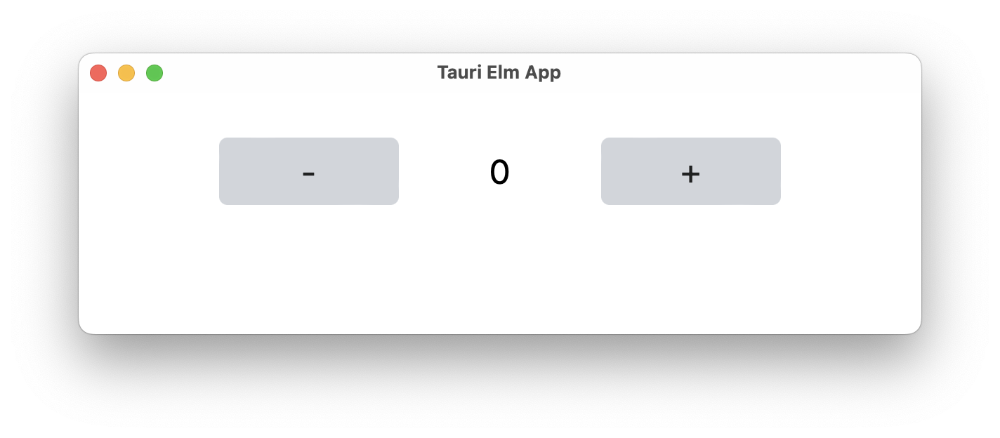

#  Tauri Elm App

Use [Tauri](https://tauri.app)
to build desktop apps with [Elm](https://elm-lang.org/)
and [Tailwind CSS](https://tailwindcss.com/)!
Uses [elm-watch](https://lydell.github.io/elm-watch/)
for hot reloading and bundling.




## Local Development

Prerequisites:

- [Install Bun](https://bun.sh/docs/installation)
- [Install Rust](https://www.rust-lang.org/learn/get-started#installing-rust)

You can then use following command
to start up the elm-watch and the Tauri dev-server:

```sh
make dev
```

Check out the [Makefile](makefile) for all available commands.
